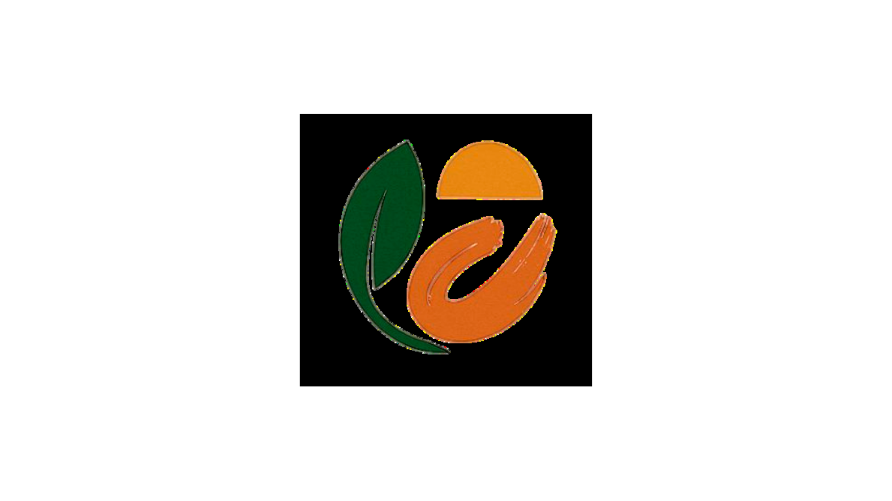

# Associação Gaya - Website Institucional



Projeto acadêmico desenvolvido para apresentar informações institucionais, eventos, projetos e atividades da Associação Gaya.

## 📖 Sobre o Projeto

O projeto consiste no desenvolvimento de um website institucional para a Associação Gaya, com o objetivo de divulgar suas atividades, projetos, eventos e iniciativas voltadas para a comunidade.

O sistema foi desenvolvido como atividade acadêmica utilizando tecnologias web fundamentais, seguindo os princípios de desenvolvimento responsivo e **Mobile First**.

## 🎯 Objetivos

- Apresentar informações institucionais da Associação Gaya;
- Divulgar eventos e projetos realizados;
- Disponibilizar uma agenda de atividades;
- Facilitar o acesso às informações da organização;
- Proporcionar uma experiência acessível e responsiva aos usuários.

## 🛠️ Tecnologias Utilizadas

- HTML5
- CSS3
- JavaScript
- GitHub

## ✨ Funcionalidades

- Página inicial institucional;
- Área de eventos;
- Área de projetos;
- Área de artesãos;
- Agenda de atividades;
- Página sobre a organização;
- Sistema de login;
- Sistema de cadastro;
- Navegação responsiva para diferentes dispositivos.

## 📂 Estrutura do Projeto

```text
Site-AssociacaoGaya/
├── assets/
│   ├── imagens e ícones
│
├── css/
│   └── style.css
│
├── js/
│   └── script.js
│
├── pages/
│   ├── eventos.html
│   ├── artesoes.html
│   ├── projetos.html
│   ├── agenda.html
│   ├── sobrenos.html
│   ├── login.html
│   └── cadastro.html
│
└── index.html
```

## 👥 Equipe

| Integrante | Responsabilidade |
|------------|------------------|
| Larissa | Home e Login |
| Gabriel | Eventos e Agenda |
| Lana | Artesãos, Sobre Nós e Cadastro |
| Sara | Projetos |

## ✅ Requisitos Implementados

- Desenvolvimento Mobile First;
- Layout responsivo;
- Navegação funcional entre páginas;
- Organização de arquivos seguindo boas práticas;
- Padronização de código entre os integrantes;
- Princípios básicos de acessibilidade.

## 🚀 Como Executar

1. Clone ou baixe o repositório.
2. Extraia os arquivos (caso tenha baixado em ZIP).
3. Abra o arquivo `index.html` em qualquer navegador moderno.

## 📱 Compatibilidade

O projeto foi desenvolvido para funcionar nos principais navegadores modernos:

- Google Chrome
- Microsoft Edge
- Mozilla Firefox
- Opera

## 📄 Licença

Projeto desenvolvido exclusivamente para fins acadêmicos.